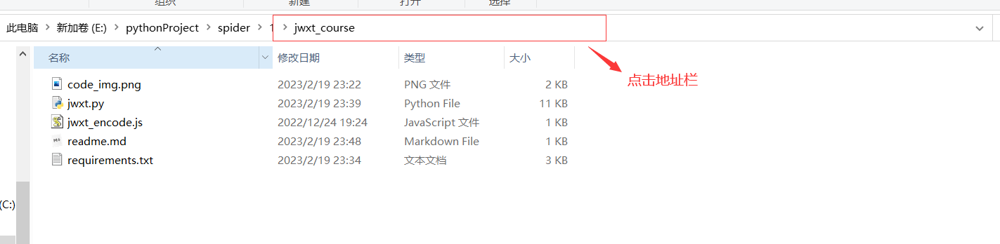
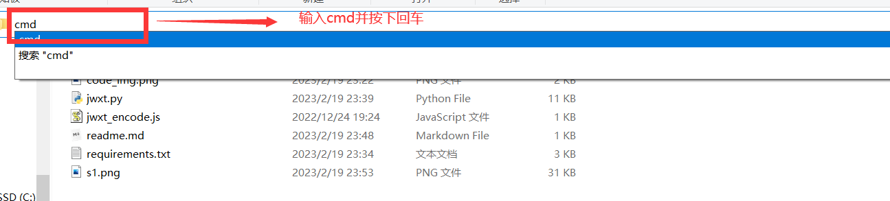
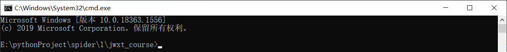
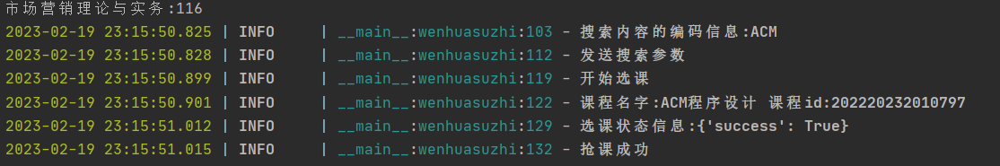

# 湘潭大学选修课抢课脚本
## 介绍
解决抢课拥堵问题，快人一步抢课，解决熬夜抢课的各种烦恼,目前支持的功能:
- 文化素质课抢课

其他的类型我的账号没有看到可以选的课,故没有添加.
## 使用方法
(1)首先电脑安装好Python环境,教程随便在网上找一篇即可

(2)在该文件夹下打开命令行,流程如下:
- 找到地址栏,如下图所示:


- 将地址栏清空,然后输入cmd,如下图所示:



- 命令行界面如下:



(3)输入如下命令,安装好需要的包
```
pip install -r requirements.txt
```

(4)在命令行输入如下命令
```
python jwxt.py -name 你的用户名 -pwd 你的密码 -course_name 你要抢的课程名字
```
也可输入以下命令查看参数说明
```
python jwxt.py -h
```

(5)抢课成功会出现:



## 开发日志
### 2023-02-13
完成初步的开发,通过手动输入用户名和密码以及验证码实现抢课
### 2023-02-19
使用额外的包完成验证码的识别,同时在命令行输入自己需要的参数,如用户名、密码等。
### 敬请期待
在考虑是否加入图形化界面
