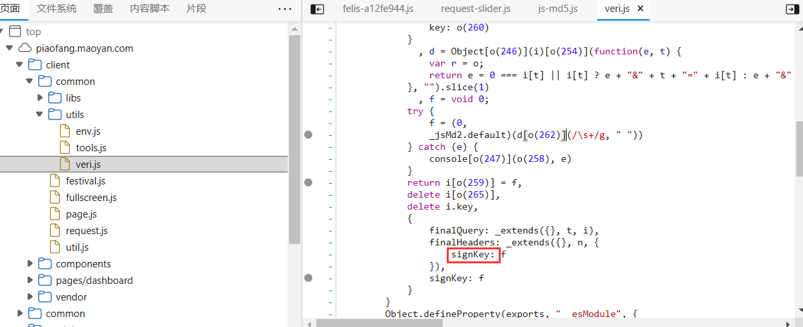
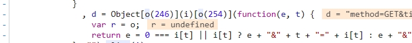

# 猫眼专业版-实时票房接口破解
猫眼票房接口:https://piaofang.maoyan.com/dashboard-ajax
## 前言
当我们想根据猫眼的接口获取票房信息的时候,发现它的接口处的参数是加密的,如下图:


红色框框的参数都是动态变化的,且signKey明显是加密的一个参数。对于这种加密的参数,我们需要从它们的js文件中找到加密方式，因此我们需要找到signKey所在的位置。

## 效果

最终的效果如下:


## 相关问题解决方案
### 1.找到veri.js
如图所示:


首先需要根据这个路径找到veri.js文件,signKey这个参数就出现在这个里面
### 2.找到signKey所在位置
如图所示:



### 3.分析它所处的这个函数的内容

可以找到请求参数里面的几个变量,这说明我们找到的文件没有错。


#### index参数的获取

将其中的o(250)输出,如下图,得到floor:


说明Math[o(250)]其实是一个向下取整的函数,故index的获得方式就是:
```javascript
Math.floor(1e3 * Math.random() + 1)
```
将它用Python实现就是:
```python
math.floor(1000 * random.random() + 1)
```

#### signKey参数的获取

通过调式(加断点),可以发现signKey的值是由这个语句获得的:


而这个语句中含有另一个参数d和o(262),对于o(262),可以在控制台得到它的值,如下图所示:


对于参数d,我们继续寻找,发现d的产生位置:



然后d是和i相关的,i的定义如下:


然后在调试的时候可以知道d的值其实是一段变量i中的key和value的字符串,如图:


而i在还有一个变量key我们是不知道的,但是由于key的值是由o(260)产生的,则我们可以将它看出一个常量,控制台输出如下:


由此跟d相关的变量我们都可以知道了,跟它相关的变量如下:
- User-Agent:代理
- timeStamp:时间戳
- index
- channelId
- method
- sVersion
- key
由此可以生成跟d相关的字符串了,d的格式:
```
method=Get&index=123&...
```

d产生后,我们再回到生成signKey的位置:


此时需要注意是先对d进行了一些字符串替换,然后进行到加密函数中去的。

继续调式,进入到加密函数当中:


这是一个md5加密的过程。

我们先对该函数进行验证,看是否会生成所需要的signKey:


以上图的d作为输入,得到结果如下:


最后的结果是一致的,说明就是这个函数。

综上所述,获取signKey的步骤为:

- 将变量i中的参数全部获取
- 将i中参数的key和value进行拼接,形成字符串d
- 将d输入到加密函数中进行加密
- 得到signKey


到此,signKey的获取也就结束了,那么接口破解也就完成了。


