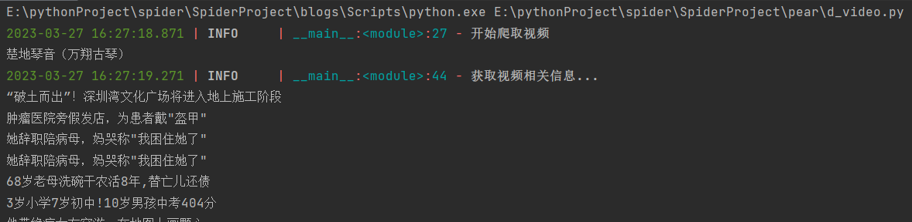
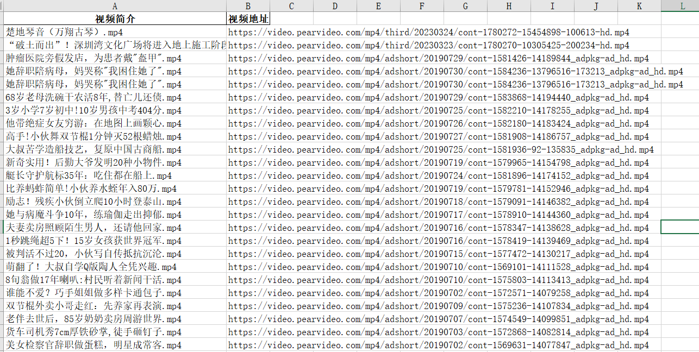

## 概述
爬取梨视频网站上的视频，并将内容保存在excel表。

## 效果

运行的结果如下:

excel保存的内容:

## 难点

有点难度的地方在于真正的视频地址的获取。
对这部分的讲解可以参考这篇文章：[爬虫入门实战第一站——梨视频视频爬取](https://blog.csdn.net/qq_41234663/article/details/127794087?spm=1001.2014.3001.5502)