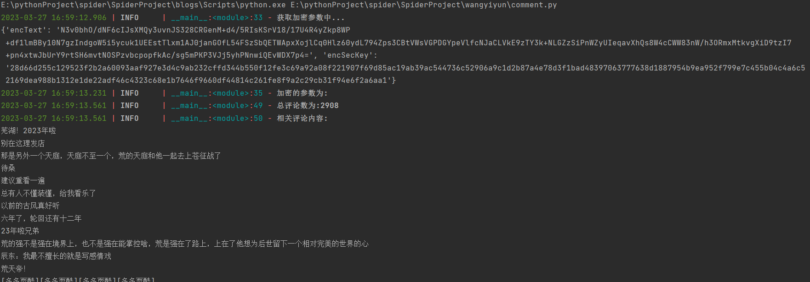

## 概述
网易云音乐网页版评论爬取。由于评论接口的参数加密和搜索音乐的加密方式相同， 因此可以扩展到搜索相关音乐

目前没有实现分页爬取，之后有时间再添加

## 效果

结果为:

## 难点
接口参数的破解，它有两个参数:
- encText
- encSecKey

需要通过一定的js逆向找到它的生成方法。
具体教程可参考：[爬虫入门实战第二站——爬取网易云网站歌曲评论](https://www.cnblogs.com/lzl2040/articles/17114778.html)