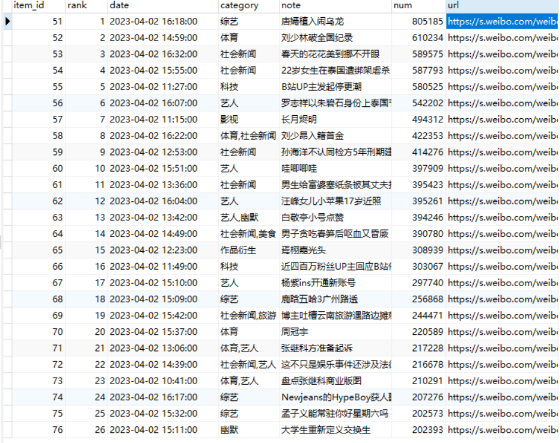
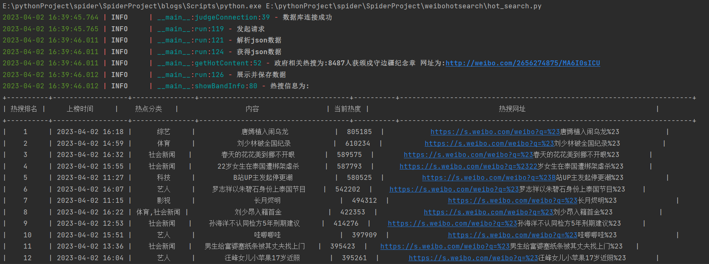

## 概述
获取微博热搜，并存在monodb数据库中

这个步骤十分简单，做这个主要是想练习将数据保存在mysql数据库当中

如果碰到mysql密码忘记的问题或者遇到
```js
ERROR 1044 (42000): Access denied for user ‘‘@‘localhost‘ to database ‘mysql‘
```
可参考这篇文章:

[解决 ERROR 1044 (42000): Access denied for user](https://blog.csdn.net/sea_snow/article/details/82498791?spm=1001.2101.3001.6661.1&utm_medium=distribute.pc_relevant_t0.none-task-blog-2%7Edefault%7ECTRLIST%7ERate-1-82498791-blog-51819561.235%5Ev27%5Epc_relevant_multi_platform_whitelistv3&depth_1-utm_source=distribute.pc_relevant_t0.none-task-blog-2%7Edefault%7ECTRLIST%7ERate-1-82498791-blog-51819561.235%5Ev27%5Epc_relevant_multi_platform_whitelistv3&utm_relevant_index=1)

## 结果

保存在mysql数据库中的结果:



命令行结果:



## 后续

可以将这个加在自己的个人网站上，每间隔一段时间获取热搜