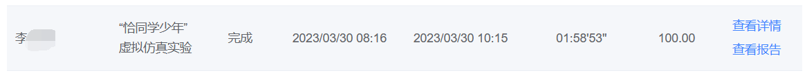
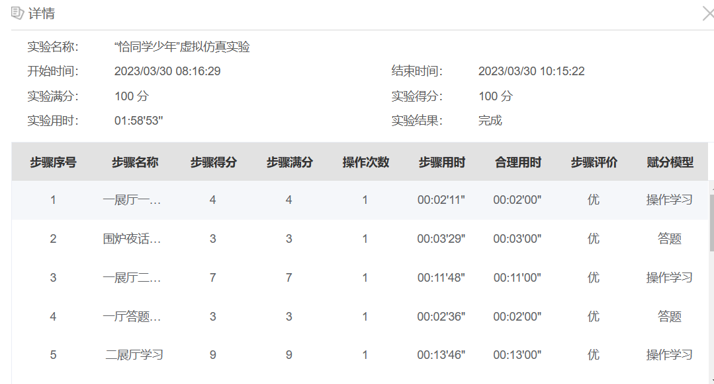
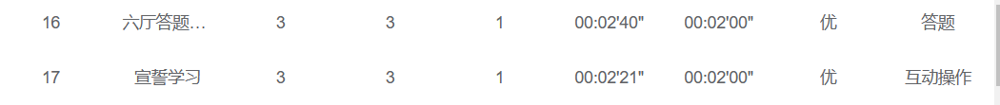
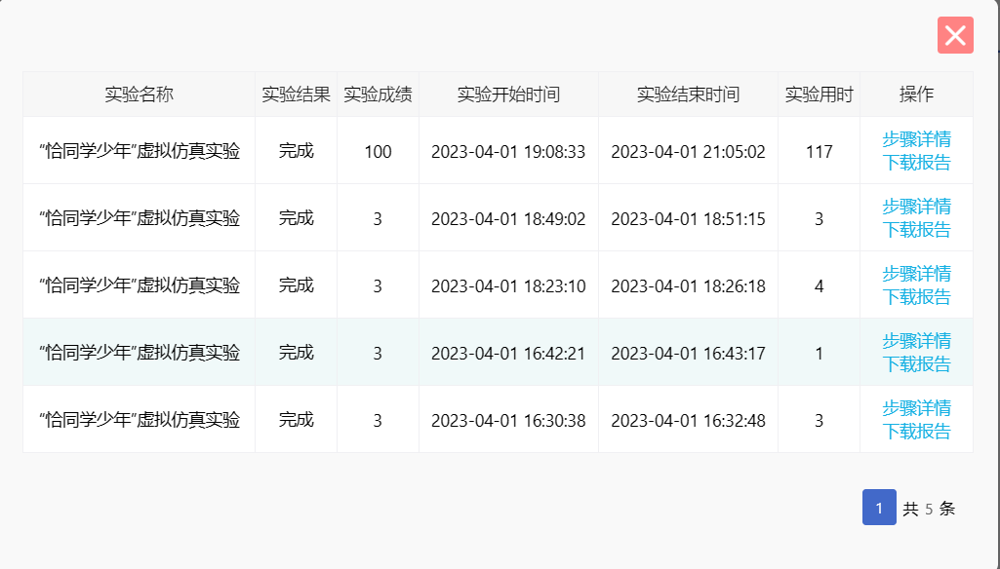

## 概述

湘潭大学恰同学少年免实验提交版

注意不要连续提交,容易被检测

## 结果










## 实现步骤
使用Fiddler抓包即可。

ticket的获取方法:

- 首先先简单做一个，进去之后直接点击宣誓台，得到一个记录

- 打开ilab个人中心做过的实验部分,然后点击恰同学少年的查看成绩
- 打开过程记得打开Fiddler进行抓包，然后找到返回的记录，在记录里面找到ticket的值。

## 运行方法
运行环境:
- python

首先填好自己的ticket

然后在该项目文件夹下运行命令:
```
python submit.py
```