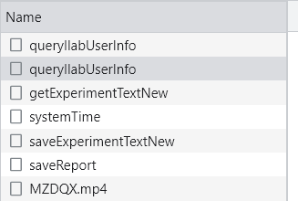
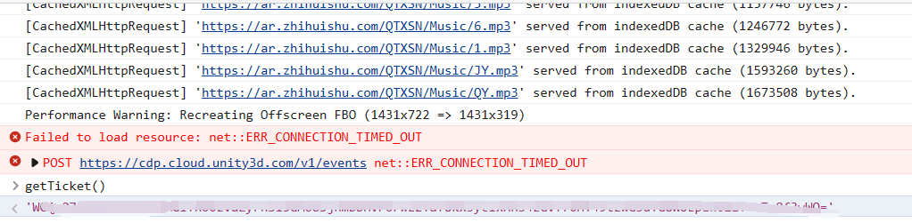

## 概述

湘潭大学恰同学少年免实验提交版

注意不要连续提交,容易被检测

接口的运行流程：


接口文件在：[interface](94_score_data.txt)

## 日志

### 2023.4.4

将headers修改

### 2023.4.5

content-length中一个英文字符或者数字长度为2 目前的长度为13188

目前需要在此基础上+7 * 2，也就是变成13202

ticket的长度为：108，如果你的ticket比这个短或者长，需要进行修改

## 结果


## 实现步骤
使用Fiddler抓包即可。

ticket的获取方法:

- 首先先简单做一个，进去之后直接点击宣誓台，得到一个记录

- 打开ilab个人中心做过的实验部分,然后点击恰同学少年的查看成绩
- 打开过程记得打开Fiddler进行抓包，然后找到返回的记录，在记录里面找到ticket的值。

也可以打开虚拟仿真平台后，按下F12键打开开发者模式，然后在控制台输入getTicket()，如下图：



## 运行方法
运行环境:
- python

首先填好自己的ticket

然后在该项目文件夹下运行命令:
```
python submit.py
```