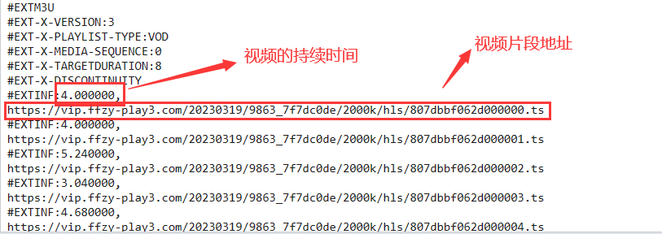

## 概述
爬取樱花动漫的视频，注意不同的源处理的方法可能不同，目前是以凡人修仙传的视频为例的。

涉及的知识:
- 多线程
- 网页视频播放的原理

## 准备知识
在一个网站中，我们不可能直接一次性将整个视频都加载出来，这样会导致速度十分慢，对用户十分不友好。
因此，通常网站加载视频的方式是将视频分成很多个部分(切片)，然后用户观看的时候一次下载一部分，而不是等到全部视频下载好了之后才能看。

m3u8文件的内容:

视频播放的顺序是从上往下依次加载的。

在项目文件夹下还需要创建video/m3u8以及video/ts文件夹，如下图所示：

## 思路

抓取视频的步骤:
- 找到m3u8文件
- 通过m3u8下载ts文件
- 合并ts文件变成mp4文件
